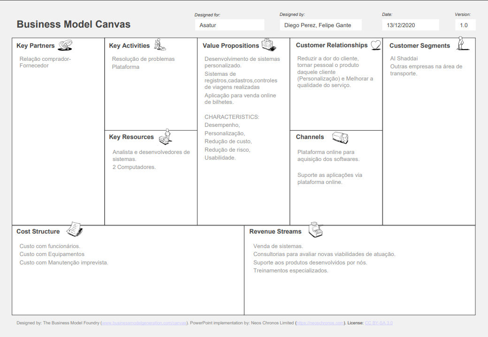

# LSI Asatur
Trabalho de Laboratório de Sistemas de Informação. 2020/2
---
Integrantes do grupo: 
[Diego Rodrigo Perez Pacheco](https://www.linkedin.com/in/diego-rodrigo-perez-pacheco-758760101/) 
[Felipe Gante Maia de Sousa](https://www.linkedin.com/in/felipe-gante-maia-de-sousa-bb5485190/)

---

# Table of contents
1. [Objetivos](#objetivos)
2. [Justificativas](#justificativas)
3. [Descrição preliminar](#preliminar)
4. [Critérios de sucesso do projeto](#sucesso)
5. [Partes interessadas do projeto](#interessandos)
6. [Riscos](#riscos)
7. [Orçamento do projeto](#orcamento)
8. [Link do Kanban](#kanban)

## Apêndice
1. [Termo de Abertura](#abertura)
2. [Canvas BMC](#canvas)
3. [Backlog](#backlog)
4. [Prototipo](#prototipo)

## Projeto Asatur

### <b>Objetivos</b>: 
    Criar um Sistema de informação para otimizar as atividades da empresa, controlar as viagens realizadas e permitir a venda de bilhetes pela internet.

### <b>Visão/Justificativas</b>: 
    O projeto visa facilitar a gestão da empresa e a compra de bilhetes pelo cliente.

### <b>Missão/Descrição preliminar</b>: 
    O projeto Asatur terá um sistema de compra de bilhetes via web, com isso o cliente não terá que ligar ou ter que vir pessoalmente agendar viagens. Na parte de gestão mudaremos a forma de registro para acabar com as perdas do mesmo e criaremos um sistema de controle das viagens realizadas.

### <b>Critérios de Sucesso</b>: 
    O projeto terá sucesso se atender a todos os critérios de aceitação da entrega, respeitar as restrições e cumprir o cronograma de execução e principalmente atender os objetivos abaixo:
    - Criar um novo sistema de Registros;
    - Criar uma aplicação para vendas online de bilhetes e
    - Criar um sistema de controle de Viagens realizadas.

### <b>Stakeholders</b>:  
1. <b> Internos: </b>  

Empresa | Participante | Função
:-------|:------------:|------:
LSI | Diego Rodrigo Perez Pacheco | Analista/Desenvolvedor
LSI | Felipe Gante Maia de Sousa |Analista/Desenvolvedor
LSI | Marta | CTO

 

2. <b>Externos: </b>  
Cliente (El Shaddai)

### <b>Riscos</b>: 

    - Enfermidades dos participantes do projeto
    - Problema nos equipamentos utilizados para desenvolvimento do sistema.

### <b>Orçamento do projeto </b>: 

    Preço do Projeto: R$ 120.000,00

### <b>Link do kanban</b>: 
[Kanban](https://github.com/Diegorpp/SLI_Project/projects/1)
  

---

### Termo de Abertura 
[Termo de Abertura](https://drive.google.com/file/d/19qzwzdCHetw09FWie09dRQ1c3oq_qk2B/view?usp=sharing)
  

### Canvas 
  
[Business Model Canvas](https://drive.google.com/file/d/15vdEhjcjtCfVnrXo-b4ZOrD2R4Ravghv/view?usp=sharing)
  

### Product Backlog 
Segue a planilha com o tempo utilizado para realização das atividades.  
[Gerenciamento do tempo das atividades](https://docs.google.com/spreadsheets/d/1S-XMt6AnhDgEYh_sVSNM7tQE1HcXYvMCAWFBtgd8L8o/edit?usp=sharing)  
[Issues relacionadas ao projeto](https://github.com/Diegorpp/SLI_Project/issues)
  

### Prototipo 
[Protótipo do Administrador](https://github.com/Diegorpp/SLI_Project/blob/main/Protipo/Mobile-adiministrator%20assatur.pdf)  
[Protótipo do Cliente](https://github.com/Diegorpp/SLI_Project/blob/main/Protipo/Mobile-cliente%20assatur.pdf)

---

### Entrega 1: 
Data: 13/12/2020  
Objetivos a serem realizados.

* Termo de abertura do projeto;
* Fazer o Canvas do negócio;
* Product Backlog;
* Apresentação do trabalho (vídeo ou reunião online);
* Prototipagem utilizando alguma ferramenta, como por exemplo: Balsamiq;
* Usar Kanban por meio de alguma ferramenta, como por exemplo: Trello;

[Apresentação da primeira entrega do trabalho](https://youtu.be/bMeAvu5CQUM)